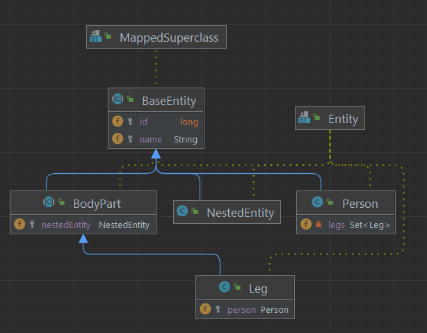
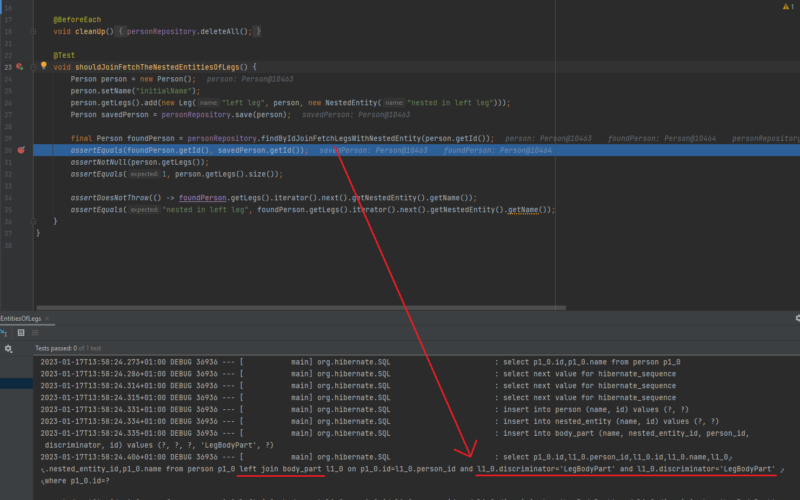

# Possible hibernate 6 bug

# Summary

- after updating spring boot to 3.0.1 (which also updates hibernate to 6.1.6.Final) join fetching of nested entities does not work anymore when the entity is in an abstract superclass that uses @Inheritance(strategy = InheritanceType.SINGLE_TABLE)
- the result is a LazyInitializationException when accessing fields in the nested entity although join fetch has been specified in the @Query

## Requisites

- entity ("Person") exists that has a field which is a set of other entities ("Set\<Leg>")
- these other entities are derived from an abstract super class ("Leg extends BodyPart")
- the abstract super class' inheritance strategy is SINGLE_TABLE
- the abstract super class has a nested entity ("NestedEntity") which has some fields

## Reproduction

- execute the test PersonPersistenceTest.shouldJoinFetchTheNestedEntitiesOfLegs
- the test basically
  - creates and saves a Person with one Leg and that Leg has a NestedEntity 
  - fetches the Person by findByIdJoinFetchLegsWithNestedEntity (a @Query method in the Repository). The query uses join fetch to specify that person->legs is fetched and also that legs->nestedEntity is fetched.
  - tries to access the nested entity via person->legs->nestedEntity->name

## Observations in Hibernate 5.6.14.Final

- the query created by findByIdJoinFetchLegsWithNestedEntity is correct

## Observations in Hibernate 6.1.6.Final

- the query created by findByIdJoinFetchLegsWithNestedEntity is NOT correct
  - there is no second left join which would join the nested_entity table
  - also, it is strange that there is a duplicate join clause l1_0.discriminator='LegBodyPart' and l1_0.discriminator='LegBodyPart'

